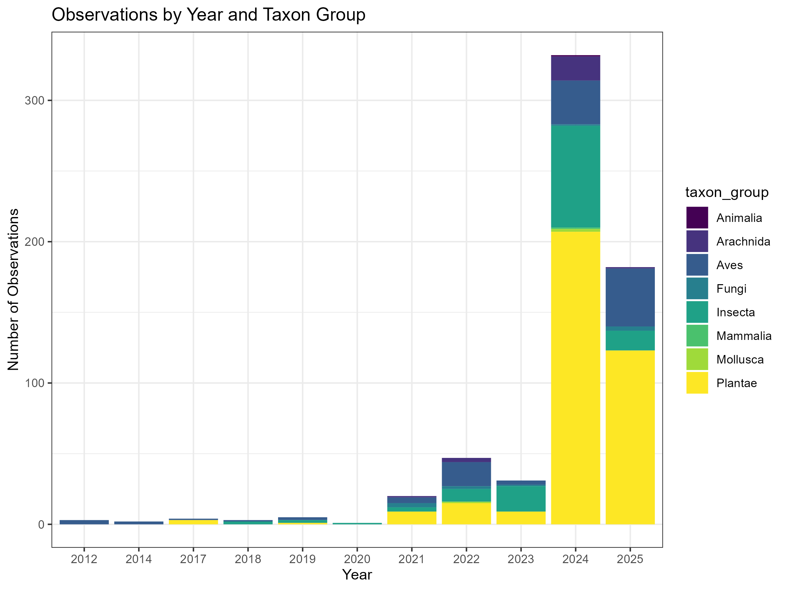
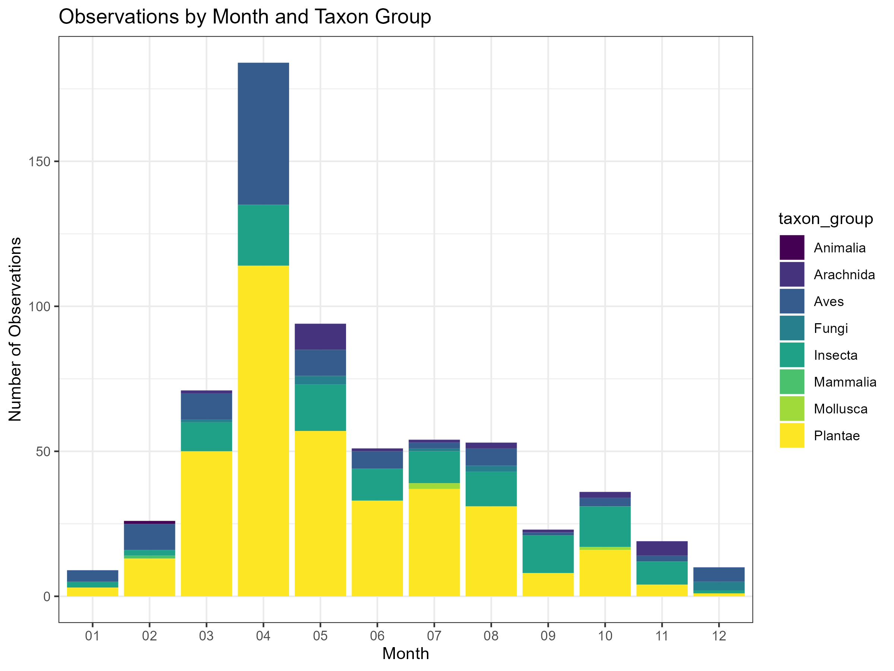
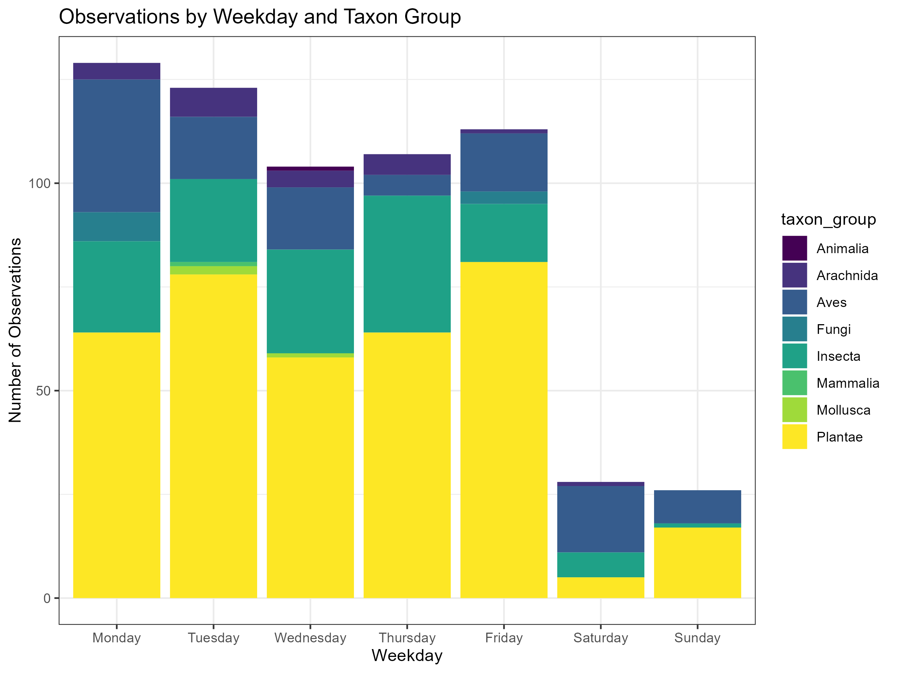
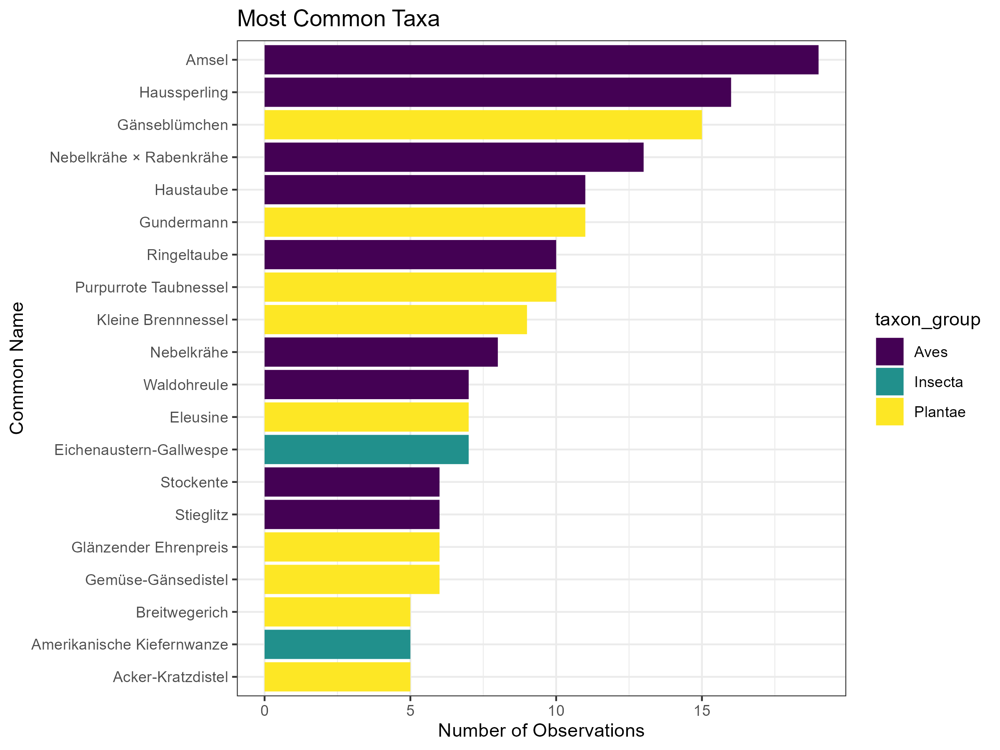
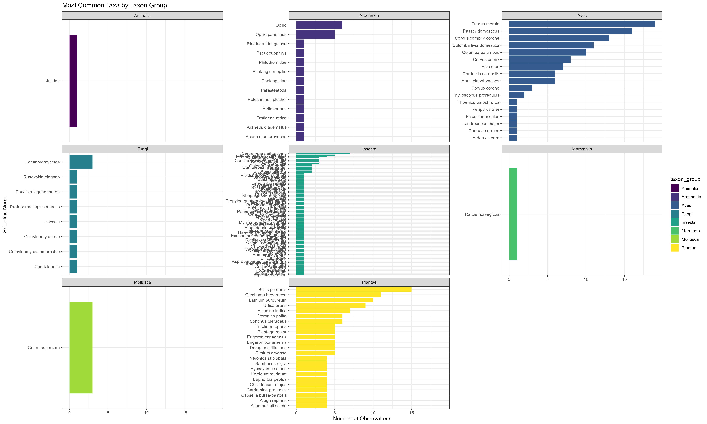

# Analysis of iNat_project ["Die anderen Museumsbesucher"](https://www.inaturalist.org/projects/die-anderen-museumsbesucher-the-other-museum-visitors?tab=observations)

## Observations by Year and Taxon Group

## Observations by Month and Taxon Group

## Observations by Day and Taxon Group

## Observations by Weekday and Taxon Group

## Most Common Taxa

## Most Common Taxa by Taxon Group

## Most Common Taxa by Taxon Group (Scientific Name)

